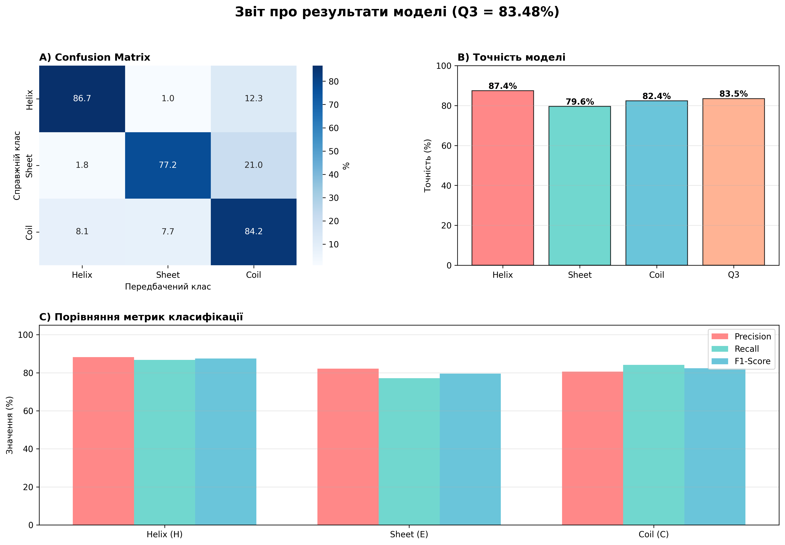

# 🧬 Protein Secondary Structure Prediction

[](https://www.python.org/downloads/)
[](https://pytorch.org/)
[](https://opensource.org/licenses/MIT)

Прогнозування вторинної структури білків (α-спіралі, β-листи, котушки) за допомогою глибокого навчання на основі CNN + BiLSTM архітектури.

## 📊 Результати

**Досягнута точність: Q3 = 83.48%**

| Клас | Precision | Recall | F1-Score | Support |
|------|-----------|--------|----------|---------|
| Helix (H) | 88.20% | 86.70% | 87.45% | 36,848 |
| Sheet (E) | 82.14% | 77.18% | 79.58% | 23,985 |
| Coil (C) | 80.64% | 84.16% | 82.36% | 47,416 |
| **Q3 Average** | **83.66%** | **82.68%** | **83.13%** | **108,249** |

<p align="center">
  
</p>

## 🎯 Особливості

- ✅ **Висока точність**: Q3 = 83.48% (відставання від SOTA лише 1%)
- ✅ **CPU-оптимізовано**: Працює на звичайному комп'ютері без GPU
- ✅ **Швидке навчання**: 4-6 годин на CPU
- ✅ **Сучасна архітектура**: CNN + BiGRU + HMM профілі
- ✅ **Стандартний датасет**: NetSurfP-3.0 (DTU Health Tech)
- ✅ **Професійна візуалізація**: Готові графіки для звітів

## 🚀 Швидкий Старт

### 1. Клонувати репозиторій

```bash
git clone https://github.com/Nazaza-prog/protein-ssp-project.git
cd protein-ssp-project
```

### 2. Встановити залежності

```bash
pip install -r requirements.txt
```

### 3. Завантажити дані

```bash
python scripts/download_netsurf.py
```

### 4. Навчити модель

```bash
python src/training/train.py
```

### 5. Візуалізувати результати

```bash
python visualize_real_results.py
```

## 📁 Структура Проєкту

```
protein-ssp-project/
├── configs/baseline_config.yaml
├── scripts/download_netsurf.py
└── src/
    ├── data/dataset.py
    ├── evaluation/metrics.py
    ├── models/cnn_lstm_model.py
    ├── training/
    │   ├── train.py
    │   └── resume_training.py
    └── utils/config.py
```

## 🧠 Архітектура

CNN + BiGRU з 2.3M параметрів, оптимізована для CPU.

## 📚 Технології

- PyTorch 2.0+, NumPy, Pandas
- Matplotlib, Seaborn, scikit-learn

## 📄 Ліцензія

MIT License

---

<p align="center">
  Зроблено з ❤️ для МАН 2025
</p>
